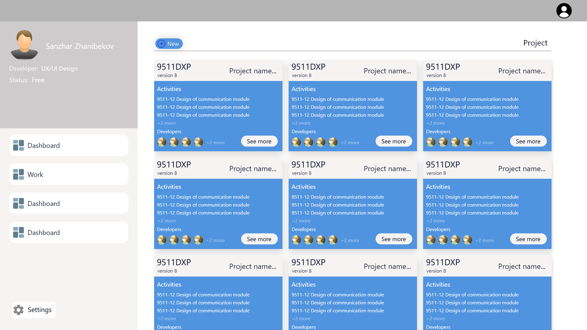
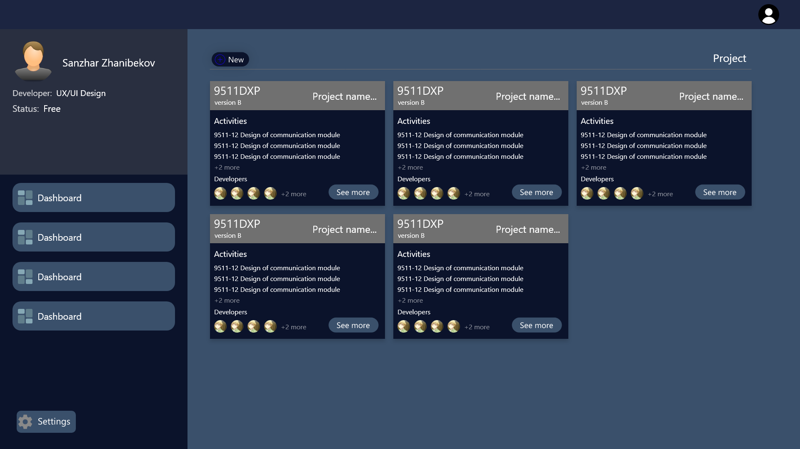
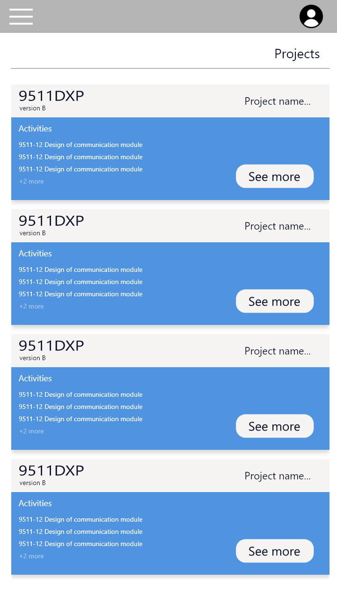
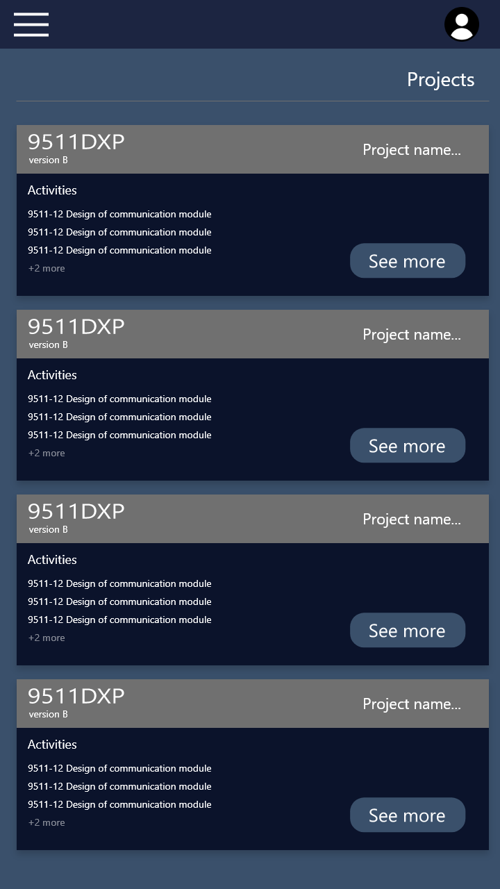

#Activity monitoring

That project was given by a teacher, in the subject of Software Engineer, where a team of _developers_ (students) must develop a product by the end of the semester.

##Get Start
###Requirements

- [IntelliJ Idea Ultimate](https://www.jetbrains.com/idea/)
  - [Java 17.0.2](https://www.oracle.com/java/technologies/javase/jdk17-archive-downloads.html)
  - [MySQL](https://www.mysql.com/downloads/)


####Config Database
Need to create a new database in MySQL. After auth in your account, next step, write a
Query:

`create database am`

More information about creating tables in db see [here](doc/database_information.md)

####Config Spring

Spring configuration is simple
 ``` spel
spring.jpa.hibernate.ddl-auto=update
spring.jpa.properties.hibernate.dialect=org.hibernate.dialect.MySQL5InnoDBDialect

server.port=8080

spring.datasource.url=jdbc:mysql://localhost:3306/am?useUnicode=true&useSSL=true&useJDBCCompliantTimezoneShift=true&useLegacyDatetimeCode=false&serverTimezone=UTC
spring.datasource.username=root
spring.datasource.password=root

spring.thymeleaf.cache=false
 ```

If you don't to create tables, change `spring.jpa.hibernate.ddl-auto=update` to`spring.jpa.hibernate.ddl-auto=create-drop`

####Run app

The last task is to start the server through the command line. Write this command

``` commandline
java -jar <path>/activity-monitoring-sdu/target/am-server-<version>.jar
```
path - is your path in file / folder
version - enter the version, see in download

Note that the server comes up on port 8080 by default. If the port is busy, it will throw an error on startup. Check if port 8080 is busy

##Documentation
The task provided by the teacher is located [at this link](doc/assets/requirements%20highlighted.pdf)

###Stack Developing
Since we are developing a full-fledged application where multi-user use is taken into account.
We use 
- Front End
    - HTML, CSS, Javascript
- Back End
    - Java, Spring (Web, Boot, Data) Thymeleaf
- UX/UI Design
  - Adobe XD
- Database
  - MySQL Server 5+

At first, we decided that we would use python, django as a development backend. But after that, we changed the decision on the 9th week of the project development that we will change the server side to Java, Spring

##Role Assignment

| Role                                                       | Assignment            |
|------------------------------------------------------------|-----------------------|
| Project Manager                                            | Dauletkhan Narynbayev |
| Database                                                   | Dias Aymuratov        |
| Backend(Analytics(Secondary))                              | Ilyas Mohammad        |
| FrontEnd (HTML, CSS, JS, Thymeleaf)                        | Ayan Serikkhan        |
| Backend(Python Django(Secondary))                          | Nurbakhyt Zhumatayev  |
| FullStack Dev (Java, Spring, FrontEnd, Databases)          | Sanzhar Zhanibekov    |
| UX/UI Design (Adobe XD)                                    | Sanzhar Zhanibekov    |


##Design in Web App

From part of the design came out good, except the nuances of the development of the design itself.
A black theme was implemented as the main theme. Then we thought about refining the light theme.

####White Web Dashboard

####Black Web Dashboard


A mobile version of the design was also implemented, where screen size and experience were taken into account

####Mobile Dashboard


